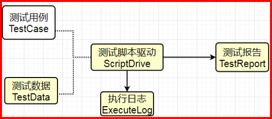

## Auto Test 框架 v2.0
> pytest + request + playwright +  allure 实现接口及ui自动化测试

简体中文 | [English](./README.en.md)

- 简易架构图




## 实现功能
- 接口直接的数据依赖: 需要B接口使用A接口响应中的某个字段作为参数
- 动态多断言： 可（多个）动态提取实际预期结果与指定的预期结果进行比较断言操作
- 支持sql查询断言
- 支持UI测试用例编写,基于po模式
- 重写源码page及context方法，支持会话保持
- 测试完成自动生成allure测试报告

## 目录结构
```shell
├─config
│  └─config.yaml	# 配置文件
├─log
│  └─YYYY-MM-DD.log	# 日志文件
├─page
  └─home.py	# UI层基础封装
├─report
│  ├─data           # allure测试结果数据
│  ├─html			      # allure报告
│  └─video		      # allure报告
├─test-result       # 测试录屏与截屏结果输出路径
├─test_case
|  └─UI
|    ├─conftest.py  # UI测试初始化
|    ├─test_case.yaml # UI测试案例，编写方法见文件说明
│    └─test_ui.py	  # 测试方法
|
├─tools		            # 工具包
│  ├─__init__.py		  # 常用方法封装
│  ├─data_process.py	# 依赖数据处理
|  ├─sql_operate.py   # 数据库操作
|  ├─email_send.py    # 邮件发送
|  ├─encode.py        # 接口加解密
|  ├─generate_data.py # 测试数据生成
|  ├─read_file.py     # yaml文件获取封装
|  └─get_cookie.py    # 获取登录用的cookie
├─requirements.txt		# 项目依赖库文件
└─main.py	# 主启动文件
```

## 使用项目
1. 依赖安装 pip install -r requirements.txt
```shell
注： 如果需要移植的目标服务器无法联网 可以通过pip download -d packages/ -r requirements.txt 命令下载依赖包到当前目录的packages/文件夹中，目标服务器再通过 pip install --no-index --find-links=packages/ -r requirements.txt 离线安装依赖包
```

2. UI编写UI测试用例
```
UI 测试用例编写指南
按照如下规范编写, 以关键字驱动测试执行
用例命名,为便于管理及美观整洁建议统一命名,如xxx(project)-xxx(mudule)-test001
descrption(用例描述)
test_step(测试步骤) 编写样例   test_step: { "open": "https://www.jd.com/",
                                "click1": "id=msShortcutLogin",
                                "fill1": {"selector": "#sb_form_q", "value": "test_account20221212"},
                                "swipe": {"x": 500, y: 800}
                                "sleep": 3000
                               }
支持的关键字有open(打开url), click1(点击事件,1则代表第一次点击,同理click2代表该测试用例中的第二次点击)
sleep(显式等待,使用毫秒),fill1(文本填充事件,需传入两个键值对,一个填充的元素对象,一个填充的值。数字1的用法与click1一致)
swipe(页面滑动事件)
expect_result(期望结果) 编写样例 {  "descrption": "期望页面"#header > span.text-header"元素的文案是'京东登录注册'",
                                   "selector": "#header > span.text-header",
                                    "value": "京东登录注册"
                                   }
```
3. 使用python main.py命令启动测试
4. 查看报告和结果


